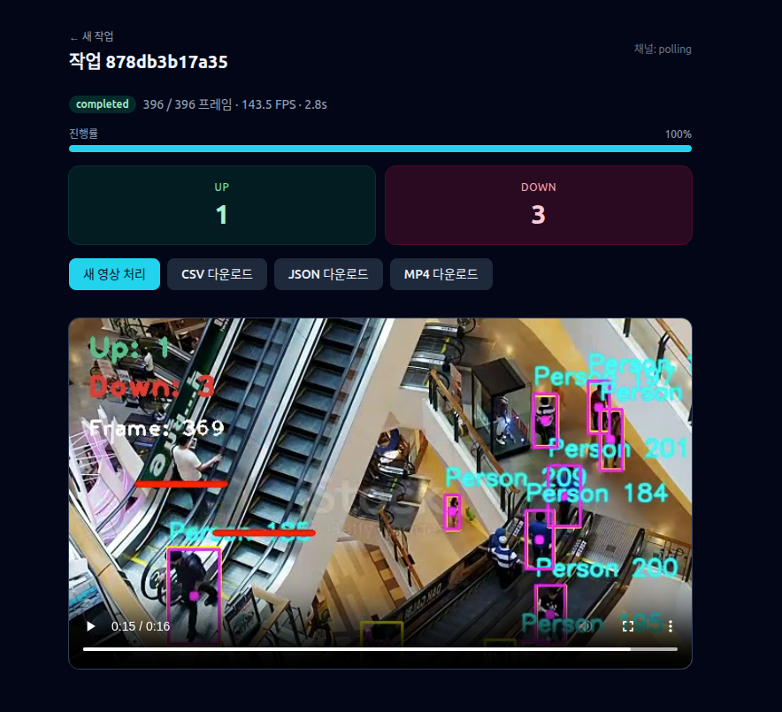

# People Counter

YOLOv8 + SORT 기반의 **사람 카운팅 풀스택 시스템** 입니다. 비디오에서 사람을 감지·추적하고, 카운팅 라인을 **실제 교차 + 이동 방향** 으로 판정해 상향/하향 인원을 집계합니다. CLI 단독 실행과 **웹 업로드 → 실시간 진행률 → 결과 영상 다운로드** 두 가지 사용 방식을 지원합니다.



---

## 주요 기능

- **YOLOv8** 실시간 사람 감지 (CUDA 자동 사용)
- **SORT** 기반 객체 추적 (Kalman + Hungarian)
- 카운팅 라인의 **실제 선분 교차 + 이동 방향(dy 부호)** 으로 정확한 상향/하향 집계
- **FastAPI + WebSocket** 백엔드 — 비디오 업로드, 실시간 진행률, Range 스트리밍
- **React + Vite + Tailwind** 프론트엔드 — 드래그앤드롭 업로드, 진행률·카운트 표시, 결과 영상 재생, CSV/JSON 다운로드
- 브라우저 호환을 위한 **ffmpeg H.264 트랜스코딩** (자동, ffmpeg 미설치 시 mp4v 폴백)
- **단일 활성 Job** 보장 — 동시 처리로 인한 GPU 경합 차단
- **CLI 모드** 도 함께 지원 — 동일한 처리 파이프라인을 공유

---

## 디렉터리 구조

```
count_people/
├── backend/                          # Python 백엔드 (FastAPI + CV 파이프라인)
│   ├── app/                          # 웹 애플리케이션 레이어
│   │   ├── main.py                   # FastAPI 엔트리포인트 + 모델 워밍업
│   │   ├── settings.py               # 환경 변수 기반 설정
│   │   ├── schemas.py                # Pydantic DTO
│   │   ├── jobs.py                   # SingleJobStore (Job 상태 + pub/sub)
│   │   ├── runner.py                 # 워커 스레드 + progress throttle
│   │   ├── pipeline.py               # run_pipeline (CLI/Web 공용)
│   │   ├── transcode.py              # ffmpeg → H.264
│   │   └── api/{jobs.py, ws.py}      # REST + WebSocket 라우터
│   ├── detector.py                   # YOLO 객체 감지
│   ├── counter.py                    # 라인 교차 + 방향 판정
│   ├── visualizer.py                 # 오버레이 시각화
│   ├── helper.py                     # VideoWriter 팩토리
│   ├── sort.py                       # SORT 추적 알고리즘
│   ├── config.py                     # 정규화 좌표 / 임계값 / 색상
│   ├── main.py                       # CLI 진입점
│   ├── requirements.txt
│   ├── yolov8n.pt                    # YOLOv8 nano 가중치
│   ├── sample.mp4
│   ├── tests/                        # pytest 테스트
│   └── storage/                      # 런타임 산출물 (Job 별 하위 디렉터리)
├── frontend/                         # React + Vite + Tailwind
│   └── src/
│       ├── api/client.ts             # REST 클라이언트
│       ├── hooks/useProgress.ts      # WS 우선 + 폴링 폴백
│       ├── pages/{Home, JobView}.tsx
│       └── components/               # Dropzone / ProgressBar / CountDisplay / VideoPlayer / Button
├── docs/
│   ├── architecture.md               # 아키텍처 문서
│   └── uml.md                        # UML (Mermaid)
└── readme.md
```

상세 설계는 [`docs/architecture.md`](docs/architecture.md) 와 [`docs/uml.md`](docs/uml.md) 를 참고하세요.

---

## 빠른 시작

### 1) 백엔드 (Python 3.10+)

```bash
cd backend
python -m venv .venv
source .venv/bin/activate              # Windows: .venv\Scripts\activate
pip install -r requirements.txt

# YOLOv8 nano 가중치는 ultralytics 가 최초 사용 시 자동 다운로드.
# 미리 받으려면:
python -c "from ultralytics import YOLO; YOLO('yolov8n.pt')"

# 서버 실행 (포트 8000)
uvicorn app.main:app --host 0.0.0.0 --port 8000 --reload
```

### 2) 프론트엔드 (Node 18.18+)

```bash
cd frontend
npm install
npm run dev                            # http://localhost:5173
```

Vite dev 서버가 `/api/*` 및 WebSocket 을 `http://127.0.0.1:8000` 으로 프록시합니다.

브라우저에서 `http://localhost:5173` 접속 → 비디오 드래그앤드롭 → 진행률·카운트가 실시간으로 표시되고, 완료 후 결과 영상이 재생됩니다.

### 3) ffmpeg (선택, 권장)

결과 영상을 H.264 + faststart 로 트랜스코딩해 Safari/iOS 등 다양한 브라우저에서 재생할 수 있습니다.

```bash
# Ubuntu/Debian
sudo apt install ffmpeg
# macOS (Homebrew)
brew install ffmpeg
```

미설치 시 mp4v 컨테이너 원본이 그대로 제공됩니다 (Chrome/Firefox 등에서는 정상 재생).

---

## CLI 사용

웹 UI 없이 단일 비디오를 처리하고 싶을 때:

```bash
cd backend
python main.py --input sample.mp4 --output output.mp4
```

주요 옵션:

| 옵션 | 설명 |
|---|---|
| `--input`, `-i` | 입력 비디오 경로 (기본: `sample.mp4`) |
| `--output`, `-o` | 출력 비디오 경로 (기본: `output.mp4`) |
| `--model`, `-m` | YOLO 가중치 경로 (기본: `yolov8n.pt`) |
| `--device` | `cuda` / `cpu` / `cuda:0` (미지정 시 자동) |
| `--no-display` | `cv2.imshow` 비활성화 (헤드리스 환경) |
| `--results` | 결과 카운트를 `.json` 또는 `.csv` 로 저장 |
| `--quiet` | 진행 바 / INFO 로그 억제 |
| `--log-level` | `DEBUG` / `INFO` / `WARNING` / `ERROR` |

미리보기 창에서 `q` 키로 즉시 종료할 수 있습니다.

---

## API 개요

| 메서드 | 경로 | 설명 |
|---|---|---|
| `GET` | `/api/health` | 헬스 체크 |
| `GET` | `/api/jobs/active` | 현재 활성 Job ID |
| `POST` | `/api/jobs` | 비디오 업로드 → Job 생성 (multipart) |
| `GET` | `/api/jobs/{id}` | Job 상태 스냅샷 |
| `DELETE` | `/api/jobs/{id}` | 처리 취소 요청 |
| `GET` | `/api/jobs/{id}/result` | 카운트 결과 JSON |
| `GET` | `/api/jobs/{id}/video` | 결과 영상 (HTTP **Range** 지원) |
| `WS` | `/api/jobs/{id}/progress` | 실시간 진행률 / 카운트 스트림 |

응답 코드:
- `409 Conflict` — 이미 처리 중인 다른 Job 이 있음 (단일 활성 보장)
- `413 Payload Too Large` — 업로드 사이즈 초과 (`PC_MAX_UPLOAD_MB`, 기본 200MB)
- `415 Unsupported Media Type` — 허용되지 않은 확장자 또는 손상된 비디오

---

## 환경 변수

| 변수 | 기본값 | 설명 |
|---|---|---|
| `PC_STORAGE_DIR` | `backend/storage` | Job 산출물 저장 디렉터리 |
| `PC_MAX_UPLOAD_MB` | `200` | 최대 업로드 사이즈 (MB) |
| `PC_TRANSCODE_H264` | `true` | ffmpeg H.264 트랜스코딩 사용 여부 |
| `PC_CORS_ORIGINS` | `http://localhost:5173,http://127.0.0.1:5173` | CORS 화이트리스트 (쉼표 구분) |
| `PC_PROGRESS_HZ` | `10` | WebSocket 진행 이벤트 throttle 주파수 |
| `PC_MODEL_PATH` | `backend/yolov8n.pt` | YOLO 가중치 경로 |

---

## 카운팅 동작

각 추적 ID 에 대해 직전 프레임 중심점과 현재 중심점을 잇는 선분이 카운팅 라인과 **실제로 교차** 하고, 동시에 이동 방향이 라인의 의도와 일치할 때만 카운트됩니다.

- `LIMITS_UP` 라인을 위쪽(↑, `dy < 0`) 으로 가로지르면 `count_up`
- `LIMITS_DOWN` 라인을 아래쪽(↓, `dy > 0`) 으로 가로지르면 `count_down`

같은 ID 는 라인당 한 번만 집계되며, 라인 근처에 머무르기만 해서는 카운트되지 않습니다.

카운팅 라인 좌표는 `backend/config.py` 의 **정규화 좌표** (`0.0 ~ 1.0`, `LIMITS_UP_NORM` / `LIMITS_DOWN_NORM`) 로 저장되어, 어떤 해상도의 영상에도 비례하여 적용됩니다.

---

## 테스트

```bash
cd backend
pytest
```

`tests/` 디렉터리에는 파이프라인 / IoU / 선분 교차 / VideoWriter 단위 테스트가 포함되어 있습니다.

---

## 요구 사항

- **Python** 3.10+ / PyTorch 1.13+ (CUDA 권장)
- **Ultralytics YOLOv8** 8.0+
- **OpenCV** 4.5+
- **FilterPy** (SORT 의 Kalman 필터)
- **FastAPI** 0.110+ / Uvicorn / Pydantic 2.x
- **Node** 18.18+ (프론트엔드)
- **ffmpeg** (선택, H.264 트랜스코딩)

자세한 의존성은 [`backend/requirements.txt`](backend/requirements.txt) / [`frontend/package.json`](frontend/package.json) 을 참고하세요.

---

## 참고 자료

- [YOLOv8 (Ultralytics)](https://github.com/ultralytics/ultralytics)
- [SORT: Simple Online and Realtime Tracking](https://github.com/abewley/sort)
- [FastAPI](https://fastapi.tiangolo.com/)
- [Vite](https://vitejs.dev/) · [React Router](https://reactrouter.com/) · [Tailwind CSS](https://tailwindcss.com/)
