# UML Diagrams

People Counter 시스템의 주요 UML 다이어그램입니다. 모두 [Mermaid](https://mermaid.js.org/) 문법으로 작성되어 GitHub/GitLab/대부분의 마크다운 렌더러에서 그대로 렌더링됩니다.

---

## 1. Use Case Diagram

사용자가 시스템과 상호작용하는 주요 유스케이스입니다.

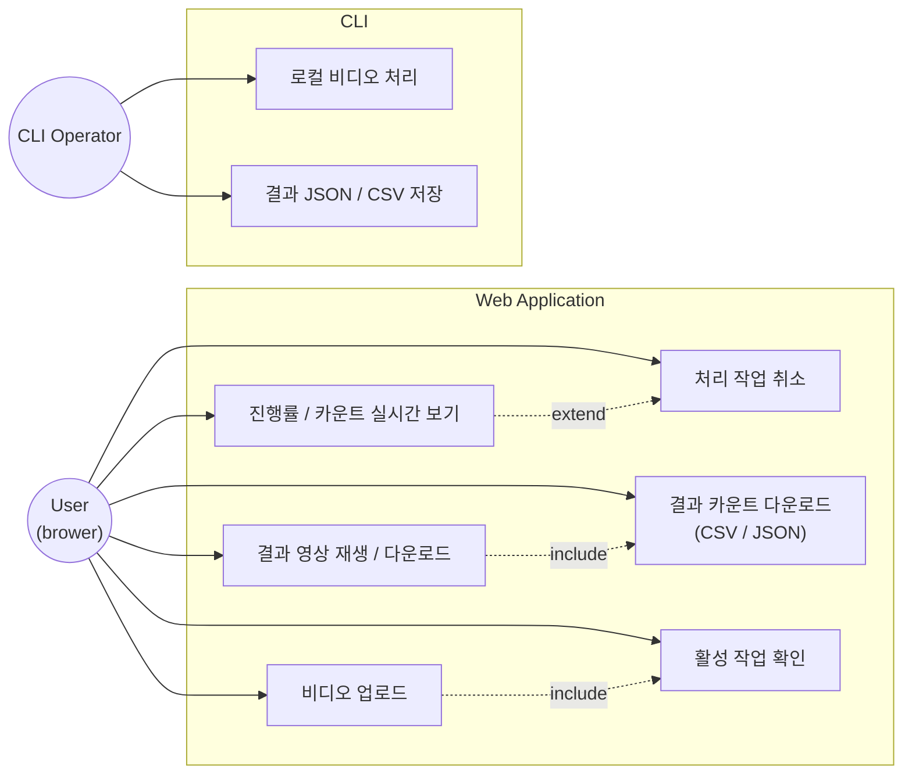

---

## 2. Component Diagram

배포/실행 단위 컴포넌트 관점입니다.

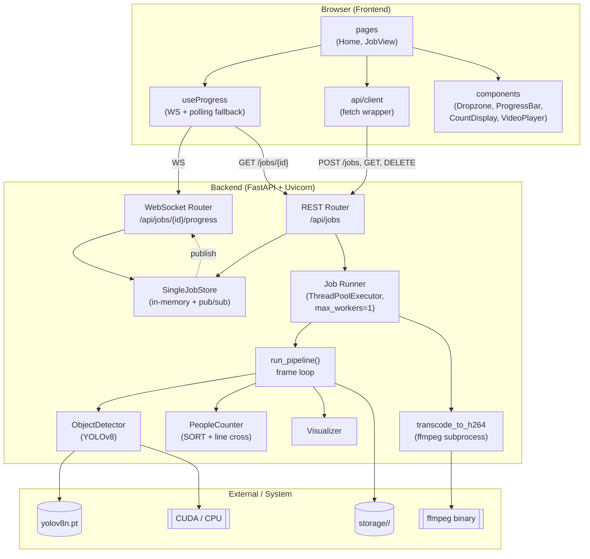

---

## 3. Class Diagram — 백엔드 도메인 / 애플리케이션

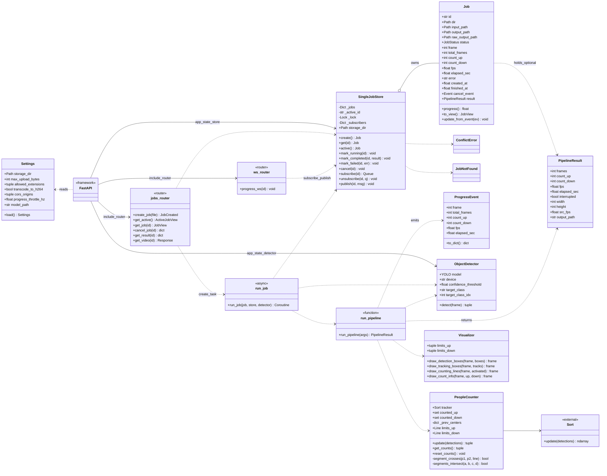

---

## 4. Class Diagram — 프론트엔드

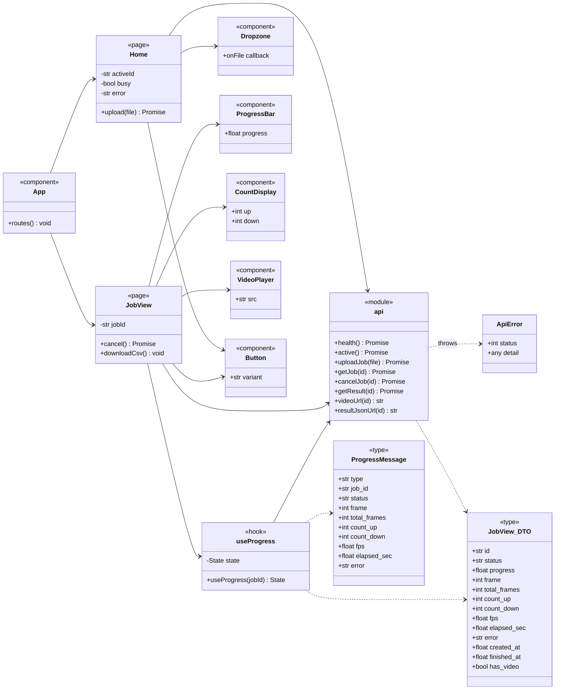

---

## 5. Sequence Diagram — 비디오 업로드 → 처리 → 결과 수신

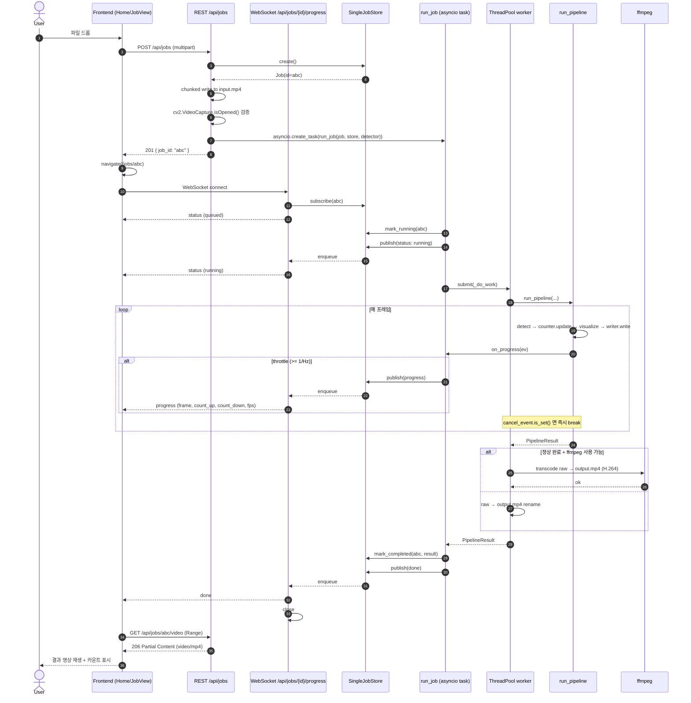

---

## 6. Sequence Diagram — 처리 작업 취소

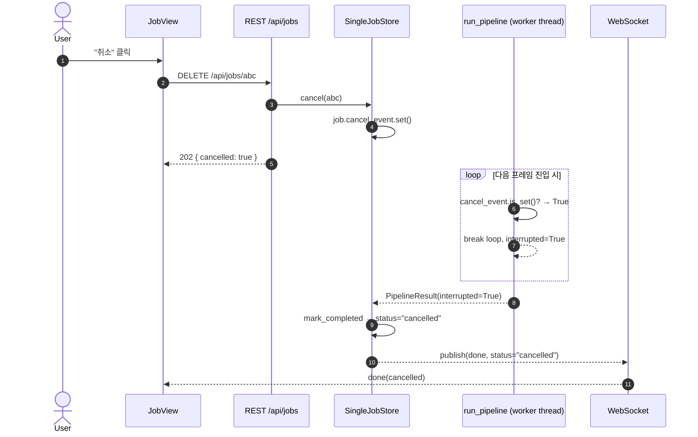

---

## 7. State Diagram — Job 라이프사이클

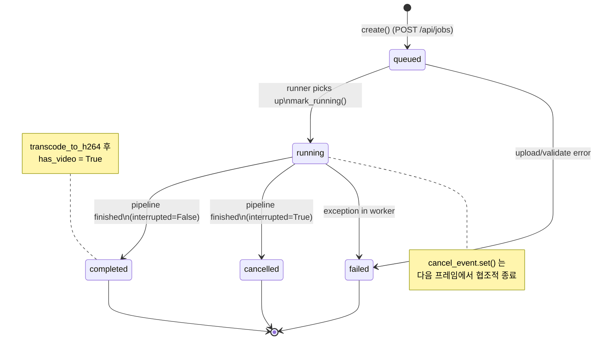

---

## 8. Activity Diagram — 프레임 처리 루프 (`run_pipeline`)

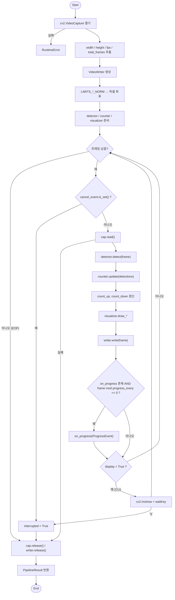

---

## 9. Deployment Diagram

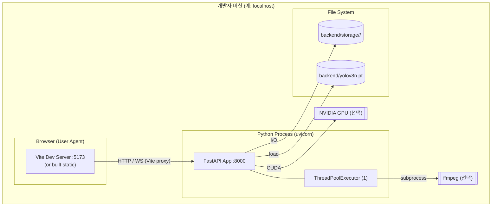

---

## 10. ER-like Data Diagram (인메모리 모델)

영속 DB가 없기 때문에 ERD 대신 **인메모리 객체 관계** 를 표시합니다.

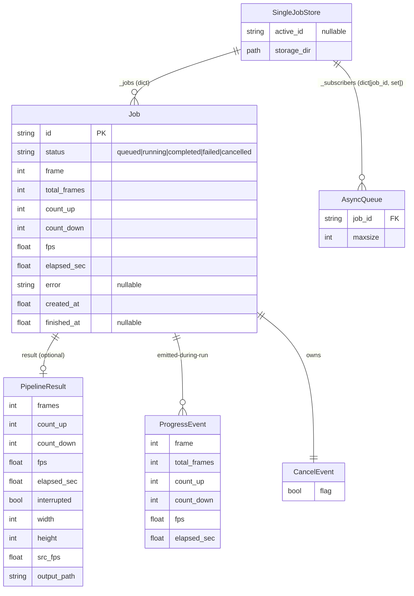

---

## 11. Counting 로직 시각 보조 (라인 교차 + 방향)

`PeopleCounter.update` 내부에서 트랙 ID별 직전 중심점과 현재 중심점을 잇는 선분이 카운팅 라인과 **실제 교차**하고, 이동 방향(dy 부호)이 라인의 의도와 일치할 때만 1회 카운트합니다.

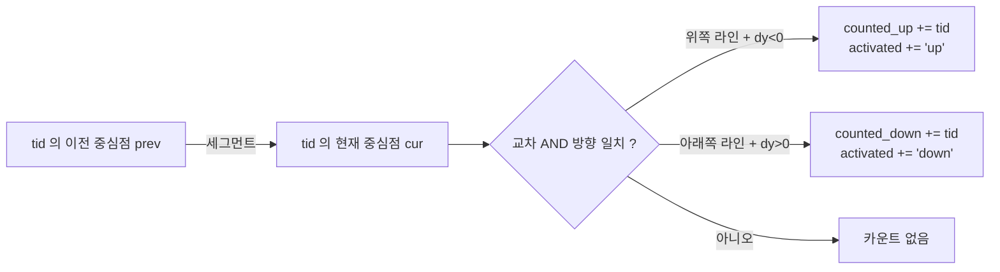

> 같은 ID는 라인당 최대 1회만 카운트되며, 라인 근처에 머무르기만 해서는 카운트되지 않습니다.
