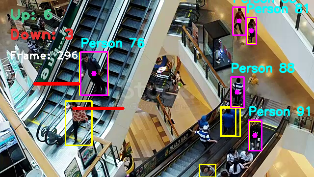

# People Counter

YOLOv8와 SORT 알고리즘을 활용한 사람 감지 및 카운팅 시스템입니다. 이 시스템은 비디오 영상에서 사람을 감지하고, 상향/하향 방향으로 움직이는 사람 수를 자동으로 카운팅합니다.



## 기능

- YOLOv8를 사용한 실시간 사람 객체 감지
- SORT 알고리즘을 활용한 객체 추적
- 상향/하향 방향 별 사람 카운팅
- 시각적 분석 결과 표시 (경계 상자, 추적 ID, 카운팅 라인, 카운트 정보)
- 처리 결과 비디오 저장

## 파일 구조

```
people-counter/
│
├── main.py               # 메인 실행 파일
├── config.py             # 설정 및 상수 관리
├── detector.py           # 객체 감지 모듈
├── counter.py            # 사람 카운팅 모듈
├── visualizer.py         # 시각화 모듈
├── helper.py             # 유틸리티 함수
├── sort.py               # SORT 추적 알고리즘
│
├── models/               # 모델 저장 디렉토리
│   └── yolov8n.pt        # YOLOv8 nano 모델
│
├── videos/               # 입력 비디오 저장 디렉토리
│   └── sample.mp4        # 샘플 입력 비디오
│
└── output/               # 출력 비디오 저장 디렉토리
    └── Output.mp4        # 출력 비디오
```

## 설치 방법

1. 저장소 클론하기:
   ```bash
   git clone https://github.com/yourusername/people-counter.git
   cd people-counter
   ```

2. 필요한 패키지 설치하기:
   ```bash
   pip install -r requirements.txt
   ```

3. YOLOv8 nano 모델 다운로드하기:
   ```bash
   mkdir -p models
   pip install ultralytics
   python -c "from ultralytics import YOLO; YOLO('yolov8n.pt')"
   ```

## 사용 방법

1. `config.py` 파일에서 입력 비디오 경로, 출력 파일 이름 등의 설정을 원하는 대로 변경합니다.

2. 메인 프로그램 실행하기:
   ```bash
   python main.py
   ```

3. 프로그램을 종료하려면 화면에서 'q' 키를 누릅니다.

## 설정 변경하기

`config.py` 파일에서 다음과 같은 설정을 변경할 수 있습니다:

- 입력/출력 비디오 경로
- 객체 감지 신뢰도 임계값
- 추적 알고리즘 파라미터
- 카운팅 라인 위치
- 시각화 색상

## 요구 사항

- Python 3.8 이상
- OpenCV 4.5 이상
- Ultralytics YOLOv8
- NumPy
- FilterPy (SORT 알고리즘용)

자세한 요구 사항은 `requirements.txt` 파일을 참조하세요.

## 참고 자료

- [YOLOv8 공식 문서](https://github.com/ultralytics/ultralytics)
- [SORT: 심플하고 온라인 가능한 실시간 추적 알고리즘](https://github.com/abewley/sort)